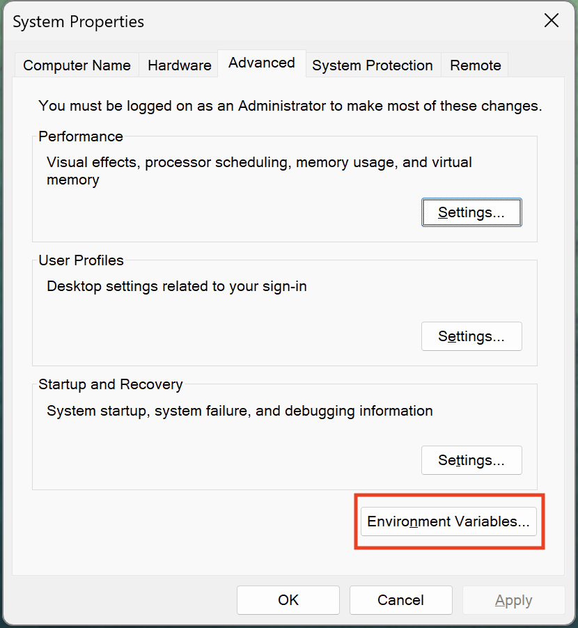
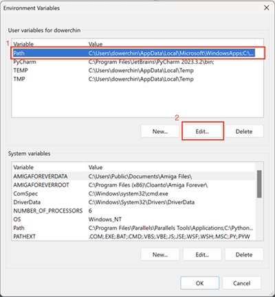
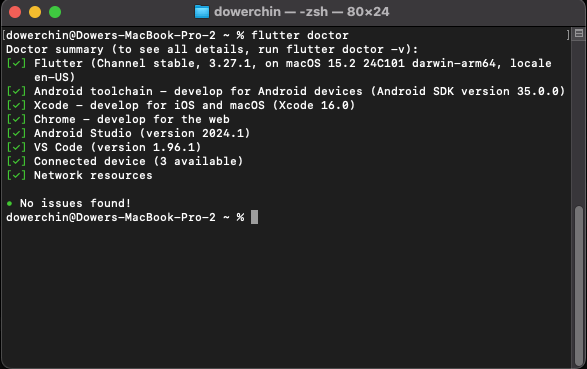

# Course Environment Setup #

Welcome to IGME-340 Multi-platform Media Application Development. Before really getting into our course, it is important to perform some inital work to ensure your experience is as smooth as possible.
The steps involved to setup the environment look intimidating, but it's really not too bad; it looks worse in writing than in practice. I have a video [walking through the installation at this link](https://youtu.be/cPImUbHOUmI), if you prefer to watch than follow this written guide (However, it's only for Windows).

This lab will go over the following items:
1. Proper Flutter installtion.
    1. Flutter SDK
    2. Android Studio
    3. Visual Studio (optional)
    4. XCode (Mac, optional)
2. Visual Studio Code setup.
3. Android Simulator setup.
4. Confirm Flutter is Ready.
5. Commenting Guidelines.
6. Submission Guidelines.
7. Assignment.

# Flutter Installation
There are number of methods to install Flutter, But this is the following method I recomment.

## Windows

1. Open a web browser to this address: https://docs.flutter.dev/get-started/install/windows/mobile
2. Download the latest Flutter version zip file.
3. Unzip the file to a folder on your C Drive or other letter drive, ex: C:\flutter.
    * DO NOT install flutter on your desktop, users folder, or program files location!
    * The folder path to the flutter __SDK MUST NOT CONTAIN__ special characters and spaces!
4. Update your Windows PATH variable:
    * Press the __Windows__ key and start typing __"env"__.
        * you should start to see an option called __"Edit the System Environment Variables"__
        * Press Enter when this opion is available. This will bring up the __"System Properties"__.
    * In the __System Properties__ window, click on the __"Environment Variables"__ button.


        


    * In the __"Environment Variables"__ window, in the top box __"User variables for (username)"__, select the __"Path"__ Variable, then click __"Edit"__.


         


    * In the __"Edit environment variables"__ window, click the __"New"__ button, and add in the path to your unzipped flutter directory, __NOTE__ You need to include the subfolder __"bin"__ in the path; For example, if you unzipped the flutter zip file to __c:\flutter__, you would add __"c:\flutter\bin"__.


        


    * Click __OK__ to close all of your windows (should be 3 times).

## Mac
Installation on OSX is a similar prospect, where you do the following:
1. Download the latest SDK zip file and extract into a folder.

    Flutter for OSX can be downloaded from [the Flutter web site](https://docs.flutter.dev/get-started/install/macos/mobile-ios). Just be sure you download the correct version for your processor, if your Mac has an M processor, you'll want to grab the ARM64 version.
    Once downloaded, you can extract the zip file contents into a folder on your desktop, or where you please, Google recommends a ~/development.

    __NOTE__ The link above is also the Flutter OSX install guide, which is more comprehensive than the summary I am providing here, so refer to the Flutter page for more details.

1. Add Flutter to your Path

    Go to your user root folder, and either edit or create a new file called __".zshenv"__
    Inside this file, put the following contents:

    ```
    export PATH=$HOME/FOLDER_TO_FLUTTER/bin:$PATH
    ```

    What this command does is adds a path to Flutter inside your terminal environment so your system knows where to find the flutter SDK files.

    In this case, if you created a folder called __"development"__, inside your usersname folder and it contains the previously extracted flutter director, you would use __"development/flutter/bin"__.
    
    this path is important, if it is wrong, Flutter will not work.

    When done, save the file and close your editor or terminal window.


# Visual Studio Code Setup
This section, we setup Visual Studio Code for Flutter development. I am assuming you already have Visual Studio Code already installed, but if you do not, please go to [the Visual Studio Code website](https://code.visualstudio.com/) and install it.

1. Launch VSCode.
2. Go to the "Extensions" section and search for __"flutter"__.
3. Install the folllowing extensions:
    1. "Flutter"
    2. "Flutter Color"

    Optional, but useful:
    1. "Error Lens"
    2. "VSCode-Icons"

# Android Simulator Setup
For this course, even though, Flutter is multi-platform, we will concentrate on using the Android Simulator. Chrome can be used as a quicker method for testing, but all assignments will be expected to run in the Android Simulator.

1. Go to [the Android Studio website](https://developer.android.com/studio) and download the latest vesrion of Android Studio.
2. Install Android Studio with the default settings.
3. Start Android Studio.
    1. first time running, you will be shown a __"Import Android Studio Settings"__ dialog. Choose the  __"Do not import settings"__ option.
    2. You will be next asked if you want to send diagnostic data to Google, you can choose whatever option you wish.
    3. The next dialog will be the "Android Studio Setup Wizard". 
        1. Here you choose the __"Custom"__ option, click "Next".
        2. Choose your desired Theme, click "Next".
        3. The __"SDK Components Setup"__ options is where you will chose what Android options you want. Here you can choose what versions of Android to install, for now you can keep the defaults and move on by clicking "Next".
        4.  Continue clicking "Next" until you get to "Finish" and click it to continue to the setup.
    4. Once the installation finishes, a final "Finish" button will be available, clicking it will bring you to the "Welcome" screen. 
        1. Click the "More Actions" and choose the "SDK Manager".
        2. We will be taken to a "Settings" window. In this window go to the "SDK Tools" tab.
        3. Here we will be given a list of checkbox options, we need to have the following checked:
            1. Android SDK Command line Tools (latest)
        4. Click "OK", you will be asked to Confirm the changes, click "OK".
            * more downloads happen here.
        5. Click "Finish" when done.

# Confirm Flutter is Ready
Finally, we can confirm Flutter is ready for use. The SDK has a handy tool called "doctor" which will check to ensure you have all the parts you need.

1. Open a terminal window (either OSX or Windows).
2. in the terminal window type in the following command:

    ```
    flutter doctor
    ```
3. You will get a report showing any issues, below is what my Mac shows:

    

4. If there any errors, Flutter will give you some options to resolve.
    * __NOTE__: There might be platform errors, such as the inability to build for Windows because Visual Studio is not available. You can ignore this for our class, since we are not going to be targeting Windows Desktop. If you do, however, wish to try this out, you will need to install Visual Studio.
    For the class, the important build targets is IOS and Chrome.

# Commenting Guidelines
Commenting isn't a sexy topic, and most young developers will ignore this step, but it is a vital skill to develop. Any organization you may end up working for will expect you to document your code, so this class ensures you understand this concept. Your code is expected to be commented according to the class commenting guidelines; failure to do so will result in loss of points on your assignments.

# Submission Guidelines
When submitting assignments, it is expected that you clean out your flutter project and ensure your project is in a folder containing your name.

1. In your project folder, open a terminal window and run the following command:

    ```
    flutter clean
    ```
    The command will clean out your flutter project of all downloaded packages and compiled project code; keeping only the main files needed to build your project.

    __NOTE__ this will cause Visual Studio Code to show errors because all the dependencies are now gone. __DO NOT BE ALARMED__! You can always rebuild your project using a "flutter pub get" to re-download all the project dependencies.

2. Either rename your project folder or copy all the project files into a folder with your name, __lastname_firstname__. Ex: chin_dower.

3. Zip the project folder up and upload to the myCourses Dropbox.

# Assignment
Now it's time to put all the above into practice. Your assigment is the following:

1. Create a folder for your project called __"lab00"__.

    __NOTE__, folder name and path must NOT contain any spaces! So avoid creating your projects on your desktop. 
2. In a terminal window, run the following command:
    ```
    flutter doctor
    ```
3. Take a screen shot of the results for submission as a png called __"flutter_doctor.png"__. 

    * Place the image in the lab00 folder.

4. Open Visual Studio Code, create a new __Flutter Project__ based on the "Application" template. Call the project __"Lab00"__.
    1. Build the project and run in the Android Simulator.
    2. Take a png screenshot of the simulator running the starter application. Name this image __"flutter_app.png"__.
        * Place the image in the lab00 folder.

5. Comment your starter application code, following the commenting guidelines.

6. Clean your project.
7. Put your project in a folder with your name on it, ex: __chin_dower__.
8. Zip the folder up into a file called __"lastname_firstname_lab00"__ and submit to the mycourses dropbox. ex: __chin_dower_lab00__.
