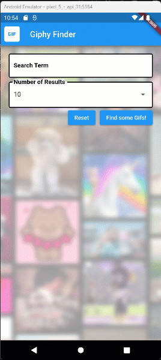

# Lab 02: GIF Finder

## I. Overview
This lab is designed to further your skills in Flutter, this time we will be using a GridView and using Flutter's HTTP functionality to call a restful API. The API, GIPHY, should be familiar since you all should have gone through IGME-230/235. This time, we're going to make GIF Finder in a Flutter App.
The plan will be I will walk you through the initial part of the lab, and you will be assigned extra activities to expand on the applications capabilities.

---

## II. Requirements
The application will start off as below

### The functional requirements are:
* Create __1__ TextField with the following criteria
  * Have a label showing what this field is.
  * Apply Border to the TextField.
  * Ensure Validation for some text to be entered into the field.
  
* Create a Dropdown containing number of desired results.
* Create __2__ buttons, `Reset` and `Find some Gifs!`. 
  * __Find some Gifs!__ performs form validation and dismisses the on-screen keyboard.
  * __Reset__ clears all the fields, the text area and resets the Dropdown to its default value. Also clear out the grid results.

---

## Your Tasks
1. Obtain your own Giphy API Key. [Giphy Developer Page](https://developers.giphy.com/)
2. Add an addtional search option (Your choice), since Giphy will return more data than we are using.
3. Make the results clickable to show a larger version of the GIF and more of the meta data.
4. Show the number of results found.
5. Customize the app with a custom font.
6. On startup load a random GIF or show what's trending.
7. Somewhere in the application, allow the user to go to the Giphy website for the result.

---

### Bonus points
There are many things that can be done to enhance this application, these are some bonus tasks, if you choose to go above and beyond.
1. Save a selected GIF to the device photo gallery.
2. Save the users previous results.
3. Impress me with your mad Flutter skills!
