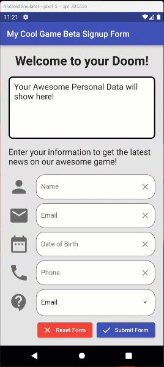

# Lab 02: TextFields & DropdownButtons

## I. Overview
This lab is designed to get your familiar with using TextFields and Dropdownbuttons which are essential for getting user input.
The lab will have you do a similar task as the Design-to-Spec lab, but this time you have more flexibility. Your goal is to create a similar functional application to the provided mockup animation. 

## II. Requirements
You are to recreate a similar application to below:

### The functional requirements are:
* Create an area to output text.
* Create __4__ TextFields with the following criteria
  * Have an icon to the left
  * Have an icon button to the right that clears the TextField
  * Have a label showing what this field is.
  * Each TextField should invoke a different keyboard, make sure you use one of each.
* Create a Dropdown of your choice with at least 3 options.
* Create __2__ buttons, `Reset` and `Submit`. 
  * __Submit__ takes all the TextField and Dropdown data and creates and outputs it to the text area.
  * __Reset__ clears all the fields, the text area and resets the Dropdown to its default value.

This project is more creative, feel free to change the contents of the mockup to whatever you want, but the funtionality needs to remain.

---
### Bonus points
There are a few complex operations that can be performed with text fields and user interaction, I will award extra credit for doing the following:
* Ensuring the keyboard does not obscure the form.
* Make finishing the text entry of a form go to the next text field.
* Add Form Validation to this exercise.
  